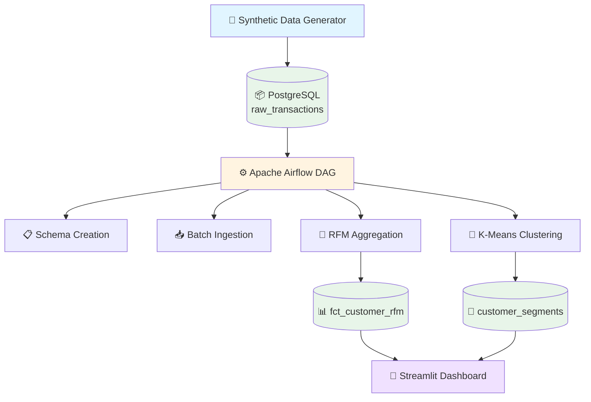
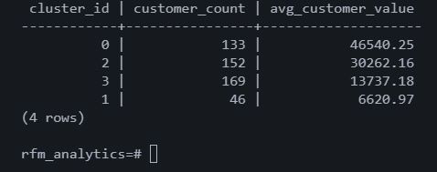

# 🎯 RFM Analysis & Customer Segmentation Platform

### *End-to-End Data Engineering Pipeline with ML-Powered Customer Insights*

[](https://www.python.org/)
[](https://airflow.apache.org/)
[](https://www.postgresql.org/)
[](https://streamlit.io/)
[](https://www.docker.com/)
[](https://scikit-learn.org/)

---

*A production-grade batch analytics pipeline that generates customer transaction data, computes **RFM metrics**, and performs **K-Means clustering** — fully orchestrated with Apache Airflow and validated through an interactive Streamlit dashboard.*

**[Features](#-key-features) • [Architecture](#-architecture) • [Quick Start](#-quick-start) • [Dashboard](#-streamlit-validation-dashboard) • [Documentation](#-pipeline-flow)**

---

## 🌟 Overview

This project demonstrates a **real-world data engineering workflow** that combines:
- ✨ Synthetic data generation mimicking customer behavior
- 🔄 Automated batch processing with Apache Airflow
- 📊 SQL-based feature engineering (RFM analysis)
- 🤖 Machine learning integration (K-Means clustering)
- 🎨 Interactive validation dashboard
- 🐳 Full containerization for reproducibility

**Built for:** Data Engineers, Analytics Engineers, and ML Engineers who want to see how modern data pipelines work end-to-end.

---

## 🚀 Key Features

| 🏗️ **Production Architecture** | 📈 **Advanced Analytics** |
|--------------------------------|---------------------------|
| • Airflow DAG orchestration<br>• PostgreSQL analytical warehouse<br>• Containerized deployment<br>• Dependency management<br>• Error handling & retry logic | • RFM metric computation<br>• Customer segmentation (K-Means)<br>• Data quality validation<br>• Real-time observability<br>• Historical trend tracking |

---

## 🏛️ Architecture



### **Data Flow Pipeline**

```
┌─────────────────────┐
│  Data Generation    │  → Synthetic customer transactions
└──────────┬──────────┘
           ↓
┌─────────────────────┐
│  Raw Ingestion      │  → PostgreSQL: raw_transactions
└──────────┬──────────┘
           ↓
┌─────────────────────┐
│  RFM Transform      │  → Recency, Frequency, Monetary
└──────────┬──────────┘
           ↓
┌─────────────────────┐
│  ML Segmentation    │  → K-Means clustering
└──────────┬──────────┘
           ↓
┌─────────────────────┐
│  Validation Layer   │  → Streamlit observability
└─────────────────────┘
```

---

## 📊 Pipeline Flow

### **1️⃣ Data Generation**
Generates realistic customer transaction data with:
- Multiple transactions per customer
- Varied purchase amounts
- Temporal patterns
- Customer behavior diversity

### **2️⃣ Batch Ingestion**
- ⚡ Airflow-triggered batch loads
- 📦 Stored in `raw_transactions` table
- ✅ Schema validation on insert
- 🔄 Idempotent operations

### **3️⃣ RFM Transformation**
SQL-based computation of customer metrics:

| Metric | Description | Calculation |
|--------|-------------|-------------|
| **Recency** | Days since last purchase | `CURRENT_DATE - MAX(transaction_date)` |
| **Frequency** | Number of transactions | `COUNT(DISTINCT transaction_id)` |
| **Monetary** | Total customer value | `SUM(transaction_amount)` |

Output → `fct_customer_rfm`

### **4️⃣ Customer Segmentation**
- 🤖 K-Means clustering on normalized RFM features
- 📌 Assigns each customer to a cluster
- 💾 Results stored in `customer_segments`
- 📊 Enables targeted marketing strategies

### **5️⃣ Validation & Observability**
Streamlit dashboard provides:
- ✅ Pipeline health checks
- 📈 Row count monitoring
- 🔍 Sample data previews
- 📊 Cluster distribution analysis
- ⚠️ Graceful error handling

---

## 🗄️ Database Schema

### **Output Tables**

| Table Name | Description | Key Columns |
|------------|-------------|-------------|
| `raw_transactions` | Transaction-level customer data | customer_id, amount, date |
| `fct_customer_rfm` | Aggregated RFM metrics per customer | customer_id, recency, frequency, monetary |
| `customer_segments` | Customer cluster assignments | customer_id, cluster_id, rfm_scores |

---

## 📱 Streamlit Validation Dashboard

### **Features**
✨ **Live Monitoring**
- Real-time row counts across all tables
- Pipeline execution status
- Data freshness indicators

🔍 **Data Exploration**
- Interactive table previews
- Searchable customer records
- Drill-down capabilities

📊 **Analytics Visualization**
- Customer segment distribution
- RFM metric distributions
- Cluster characteristics

⚡ **Robustness**
- Handles partial pipeline states
- Graceful error messages
- Safe fallbacks for missing data

### **Dashboard Screenshots**

#### 📈 Row Counts & Table Preview


#### 🎯 Customer Segment Distribution


---

## ⚡ Quick Start

### **Prerequisites**
```bash
✓ Docker Engine 20.10+
✓ Docker Compose 2.0+
✓ 4GB RAM minimum
```

### **1. Clone Repository**
```bash
git clone https://github.com/Akshay-kumar01/RFM-Analysis.git
cd rfm-segmentation-platform
```

### **2. Launch Platform**
```bash
docker-compose up -d
```

### **3. Access Services**

| Service | URL | Credentials |
|---------|-----|-------------|
| 🌪️ **Airflow UI** | [http://localhost:8080](http://localhost:8080) | admin / admin |
| 📱 **Streamlit Dashboard** | [http://localhost:8501](http://localhost:8501) | - |
| 🗄️ **PostgreSQL** | `localhost:5433` | postgres / postgres |

### **4. Trigger Pipeline**
1. Navigate to Airflow UI
2. Enable the `rfm_customer_segmentation` DAG
3. Trigger manually or wait for scheduled run
4. Monitor execution in Airflow
5. Validate results in Streamlit dashboard

---

## 🧪 Sample Validation Queries

```sql
-- Raw ingestion check
SELECT COUNT(*) FROM raw_transactions;

-- RFM validation
SELECT AVG(recency), AVG(frequency), AVG(monetary)
FROM fct_customer_rfm;

-- Cluster-level business value
SELECT
    cs.cluster_id,
    COUNT(*) AS customer_count,
    ROUND(AVG(rfm.monetary), 2) AS avg_customer_value
FROM customer_segments cs
JOIN fct_customer_rfm rfm
  ON cs.customer_id = rfm.customer_id
GROUP BY cs.cluster_id
ORDER BY avg_customer_value DESC;
```

---

## 🎯 Project Highlights

| **Feature** | **Description** |
|:-----------|:---------------|
| **End-to-End Orchestration** | Airflow DAGs manage entire pipeline lifecycle |
| **Hybrid Processing** | SQL transformations + Python ML integration |
| **Production Patterns** | Idempotency, error handling, retry logic |
| **Observability First** | Built-in validation and monitoring dashboard |
| **Fully Containerized** | One-command deployment, zero config drift |
| **Realistic Simulation** | Handles timing dependencies like production systems |

---

## 🔮 Future Enhancements

- [ ]  **Incremental Loading** - Delta processing instead of full refreshes
- [ ]  **Data Quality Framework** - Automated checks for nulls, duplicates, thresholds
- [ ]  **Freshness Monitoring** - SLA tracking and alerting
- [ ]  **Historical Trends** - Track segment evolution over time
- [ ]  **CI/CD Integration** - Automated testing and deployment
- [ ]  **Advanced ML Models** - Prophet for forecasting, anomaly detection
- [ ]  **Multi-Environment** - Dev/Staging/Prod configurations

---

## 🛠️ Technology Stack

| Category | Technologies |
|----------|-------------|
| **Languages** | Python 3.9+, SQL |
| **Orchestration** | Apache Airflow 2.x |
| **Storage** | PostgreSQL 14 |
| **ML/Analytics** | scikit-learn, Pandas, NumPy |
| **Visualization** | Streamlit, Matplotlib |
| **Infrastructure** | Docker, Docker Compose |

---

## 👨‍💻 Author

**Akshay Kumar**  
*Data Engineer / Analytics Engineer*

[](https://github.com/Akshay-kumar01)
[](https://www.linkedin.com/in/akshay-kumar-singh-56a4aa202/)
[](mailto:your.singhkumarakshay22@gmail.com)

---

## 📝 Notes

> **Design Philosophy:**  
> This project prioritizes **engineering correctness** and **observability** over analytics output alone. It demonstrates how data pipelines behave in production environments with realistic dependency management, error handling, and validation layers.

**Key Learnings:**
- ✅ Building production-grade batch pipelines
- ✅ Integrating ML into data workflows
- ✅ Implementing validation and monitoring
- ✅ Managing orchestration dependencies
- ✅ Containerizing complex data platforms

---

### ⭐ If you found this helpful, please star the repository!

**Built with ❤️ by Akshay Kumar Singh**